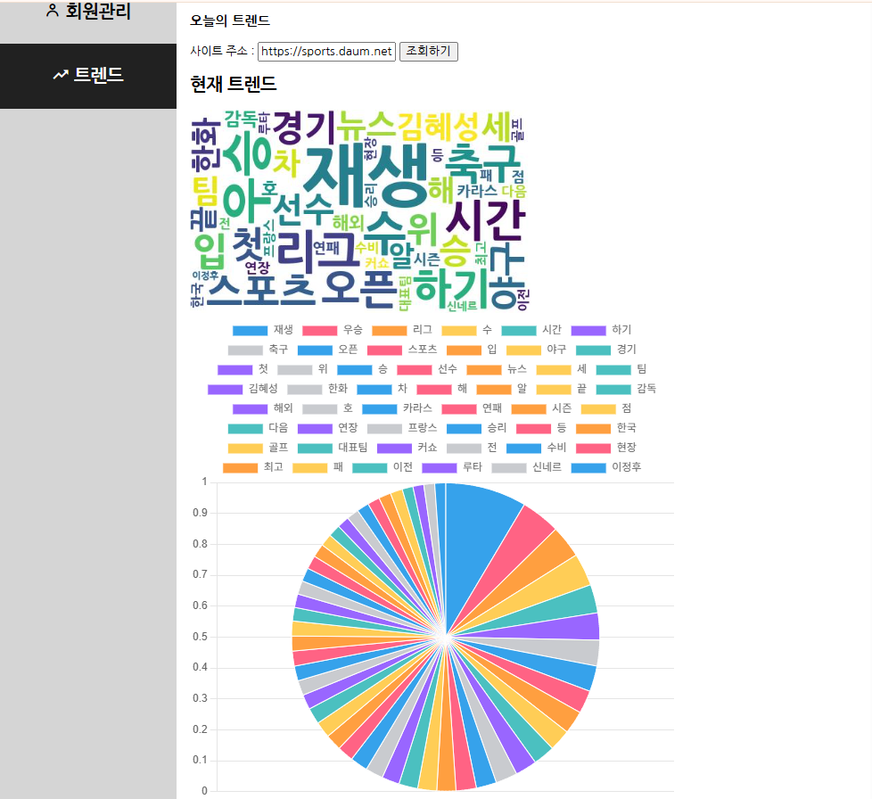
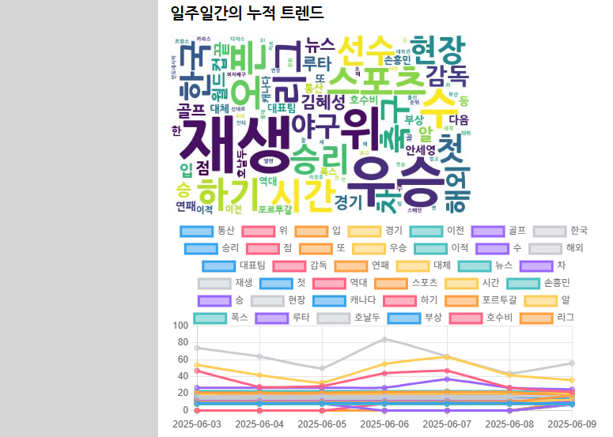
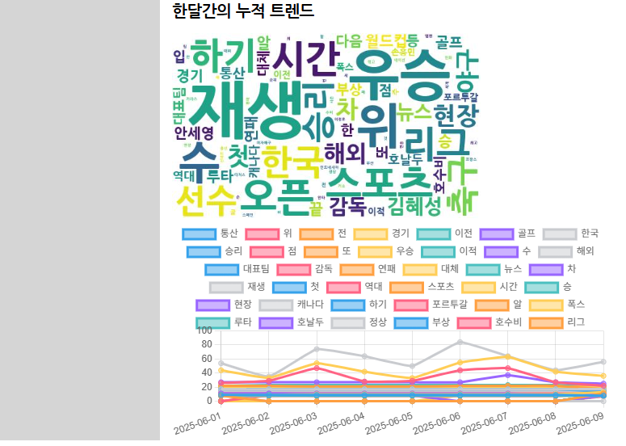

# 프로젝트 소개
## 개요
- 프로젝트명 : 기간별 트렌드 분석  

관리자에게 있어 트렌드를 아는 것은 중요할 것이다.  
하지만 관리자에게 필요한 트렌드가 오늘이 될지, 아니면 일주일 전이 될지 우리는 알 수 없다.  
관리자의 요청에 맞는 특정 기간 트렌드를 어떻게 조회할 수 있을까?

# 기능 설명
- 입력한 url 웹 페이지의 정보를 크롤링하고 저장
- 크롤링한 데이터를 워드 클라우드 이미지와 그래프를 통해 시각화

## 역할 분담
- 김문수, url 치환코드 작성, 크롤링 관련 코드 작업, 워드클라우드 생성 파이썬 파일 작업
- 이소민, 30일 데이터 크롤링 코드 작성, 화면 출력 작업
- 정호찬, 7일 데이터 크롤링 코드 작성, 
- 주예성, 30일 데이터 크롤링 코드 작성, 입력 url 관리 코드 작업
- 주용현, 7일 데이터 크롤링 코드 작성, 트렌드 데이터 조회 코드 작업

## 구현 화면

